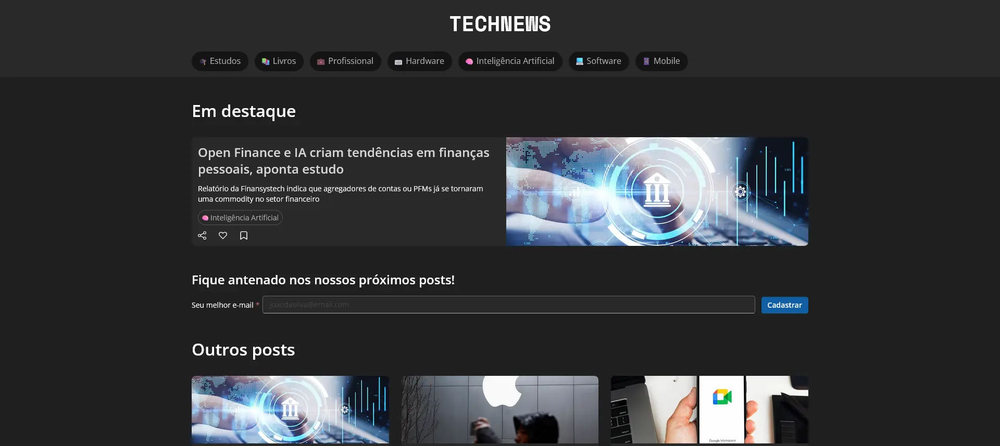
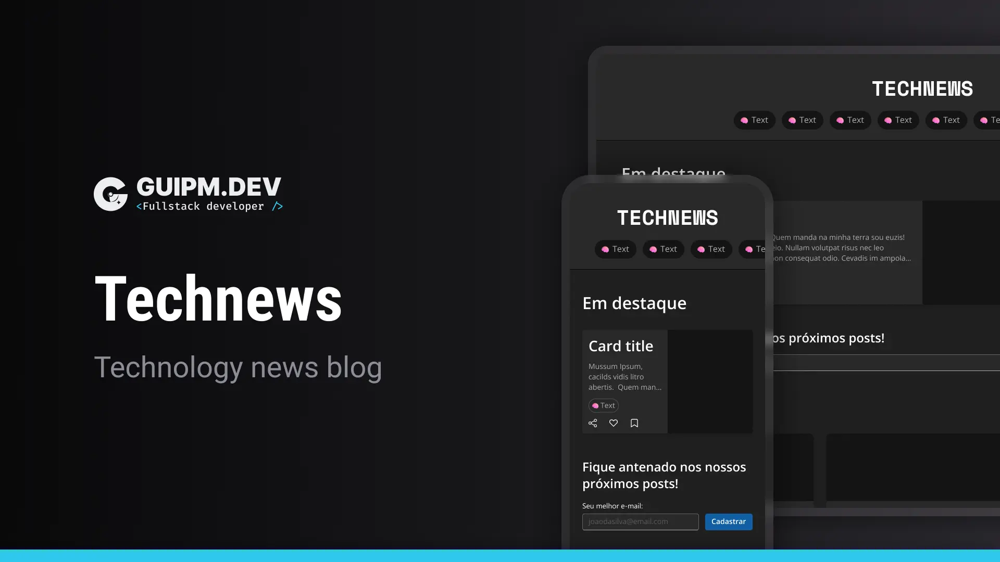

<!-- ===== HEADER ===== -->
<p align="right">
  
  <a href="./README.pt-br.md" title="Ler o README em português brasileiro">
    
  </a>
</p>

<h1 align="center">
  <a
    href="https://guipmdev.github.io/technews/"
    title="Go to the web application"
  >
    
  </a>
</h1>

<p align="center">
  
  
  
  <a
    href="https://github.com/guipmdev/technews/commits/main"
    title="View repository commits"
  >
    
  </a>
  <a href="./LICENSE" title="View project license">
    
  </a>
  <a href="https://guipm.dev/" title="Go to the guipm.dev website">
    
  </a>
</p>



<p align="center">
  <a href="https://guipmdev.github.io/technews/"
    >Go to the web application ↗</a
  >
</p>

<details>
  <summary>
    <h2>📒 Table of Contents</h2>
  </summary>

- [📍 Overview](#-overview)
- [✨ Features](#-features)
- [🤖 Demo](#-demo)
- [🎨 Layout](#-layout)
- [🛠 Technologies](#-technologies)
  - [Website](#website)
  - [Utils](#utils)
- [🚀 Getting Started](#-getting-started)
  - [✔️ Prerequisites](#️-prerequisites)
  - [📦 Installation](#-installation)
  - [⚙️ Usage](#️-usage)
- [📄 License](#-license)
- [👏 Acknowledgments](#-acknowledgments)
</details>

<!-- ===== PROJECT INFOS ===== -->

## 📍 Overview

The project is a web application based on _Jekyll_ that works as a complete source of news and information about technology, covering various topics from software development to hardware innovations, making it easy for enthusiasts, professionals and students of technology to stay informed about the latest trends.

The site features a user-friendly design, including responsive layouts, newsletter sign-up and social media integration, making it a must-visit destination for technology updates.

## ✨ Features

📚 Access a wealth of **tech information**

📂 Quick access to **content filtered by category**

⏭️ **View more articles** without leaving the main page with the **'Load more' button**

📊 **Share, like, and save posts**

💬 Engage in discussions by leaving **comments on articles using your GitHub account**

📝 Enjoy the convenience of interactive **forms powered by PHP**

📱 **Optimized for seamless viewing on all devices**

## 🤖 Demo

https://github.com/guipmdev/technews/assets/136738335/375e607c-c54c-4a8e-a191-7df84d6a5005

## 🎨 Layout

The layout of the application was designed by **guipm.dev** and is available on [Figma](https://www.figma.com/file/CrB7qDGMw67VW5XSY1hFN2/Technews).

<p align="center">
  
</p>

## 🛠 Technologies

The following tools were used to build the project:

### Website

<p>
  <a href="https://jekyllrb.com/">
    
  </a>
  <a href="https://developer.mozilla.org/en-US/docs/Web/JavaScript">
    
  </a>
  <a href="https://www.php.net/">
    
  </a>
</p>

<p>
  <a href="https://getbootstrap.com/">
    
  </a>
  <a href="https://sass-lang.com/">
    
  </a>
</p>

_\* See the [<kbd>Gemfile</kbd>](./Gemfile) file_

### Utils

<p>
  <a href="https://git-scm.com/">
    
  </a>
  <a href="https://www.ruby-lang.org/">
    
  </a>
  <a href="https://figma.com/">
    
  </a>
  <a href="https://fonts.google.com/">
    
  </a>
  <a href="https://code.visualstudio.com/">
    
  </a>
</p>

## 🚀 Getting Started

### ✔️ Prerequisites

Before you begin, ensure that you have the following tools installed on your machine: [Git](https://git-scm.com/downloads), [Ruby](https://www.ruby-lang.org/en/downloads/), and [RubyGems](https://rubygems.org/pages/download). It's also good to have an editor to work with the code, such as [VSCode](https://code.visualstudio.com/Download).

### 📦 Installation

1. Install the jekyll and bundler gems:

```sh
gem install jekyll bundler
```

2. Clone the repository:

```sh
git clone https://github.com/guipmdev/technews/
```

3. Change to the project directory:

```sh
cd technews
```

4. Install the dependencies:

```sh
bundle install
```

### ⚙️ Usage

1. Start the web application:

```sh
bundle exec jekyll serve --livereload
```

2. Access https://localhost:4000/technews/ to view the application

## 📄 License

This project is licensed under the terms of the `MIT` license. See the
[LICENSE](./LICENSE) file for additional info.

## 👏 Acknowledgments

> - Many thanks to the devs [Ricardo Franco](https://www.linkedin.com/in/francocontigo/) and [Bruno do Amaral](https://www.linkedin.com/in/bruno-do-amaral-8b4ab6142/) for their excellent work in putting this project together

<!-- ===== FOOTER ===== -->

---

<p align="center">
  Made with 💙 by
  <a href="https://www.guipm.dev/"> @guipm.dev </a>
  - Feel free to
  <a href="mailto:guipm.dev@gmail.com">contact me</a>!
</p>

<br />

<p align="center">
  <a href="#top">
    <b>↑&nbsp;&nbsp; Return to the top &nbsp;&nbsp;↑</b>
  </a>
</p>
